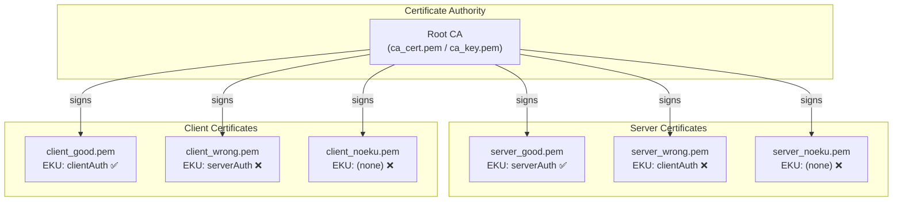
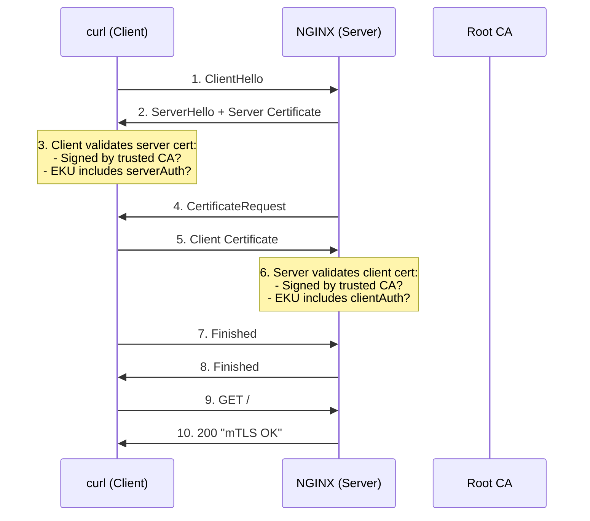
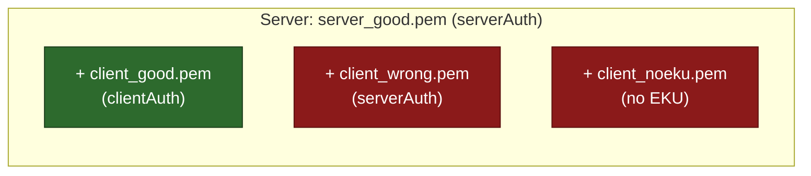
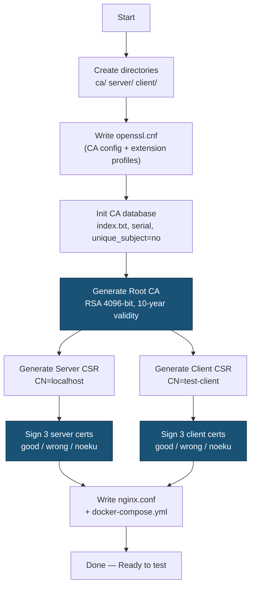

# mTLS Lab — Mutual TLS Testing Environment

A self-contained lab for generating and testing **mutual TLS (mTLS)** certificates with various Extended Key Usage (EKU) combinations. Uses OpenSSL for certificate generation and NGINX as the mTLS-enforcing server.

---

## Overview

This lab creates a full PKI (Root CA → Server Certs → Client Certs) and an NGINX reverse proxy that enforces client-certificate verification. It generates **correct** and **deliberately broken** certificates so you can observe exactly how mTLS handshakes succeed or fail based on EKU settings.

---

## Architecture



---

## mTLS Handshake Flow



---

## Test Matrix — Expected Results



| Server Cert | Client Cert | Expected Result |
|---|---|---|
| `server_good.pem` (serverAuth) | `client_good.pem` (clientAuth) | **✅ 200 OK** |
| `server_good.pem` (serverAuth) | `client_wrong.pem` (serverAuth) | **❌ SSL handshake failure** |
| `server_good.pem` (serverAuth) | `client_noeku.pem` (no EKU) | **❌ SSL handshake failure** |
| `server_wrong.pem` (clientAuth) | `client_good.pem` (clientAuth) | **❌ curl rejects server cert** |
| `server_noeku.pem` (no EKU) | `client_good.pem` (clientAuth) | **❌ curl rejects server cert** |

---

## Certificate Generation Flow



---

## Directory Structure (after running the script)

```
mtls-lab/
├── ca/
│   ├── openssl.cnf         # CA configuration + extension profiles
│   ├── ca_cert.pem          # Root CA certificate
│   ├── ca_key.pem           # Root CA private key
│   ├── index.txt            # CA certificate database
│   ├── index.txt.attr       # unique_subject = no
│   ├── serial               # Next serial number
│   └── certs/               # Signed certificate copies
├── server/
│   ├── server_key.pem       # Server private key
│   ├── server_csr.pem       # Server CSR
│   ├── server_good.pem      # ✅ EKU: serverAuth
│   ├── server_wrong.pem     # ❌ EKU: clientAuth (wrong)
│   └── server_noeku.pem     # ❌ No EKU
├── client/
│   ├── client_key.pem       # Client private key
│   ├── client_csr.pem       # Client CSR
│   ├── client_good.pem      # ✅ EKU: clientAuth
│   ├── client_wrong.pem     # ❌ EKU: serverAuth (wrong)
│   └── client_noeku.pem     # ❌ No EKU
├── nginx.conf               # NGINX mTLS config
└── docker-compose.yml       # Docker Compose for NGINX
```

---

## Prerequisites

- **OpenSSL** (1.1+ or 3.x)
- **Docker** & **Docker Compose** (for the NGINX server)
- **curl** (for testing)

---

## Quick Start

### 1. Generate all certificates

```bash
chmod +x generate-certs.sh
./generate-certs.sh
```

### 2. Start the NGINX mTLS server

```bash
cd mtls-lab
docker compose up -d
```

### 3. Run the tests

```bash
# ✅ PASS — correct client cert
curl -vk https://localhost:8443 \
  --cert client/client_good.pem \
  --key client/client_key.pem

# ❌ FAIL — client cert has wrong EKU (serverAuth instead of clientAuth)
curl -vk https://localhost:8443 \
  --cert client/client_wrong.pem \
  --key client/client_key.pem

# ❌ FAIL — client cert has no EKU at all
curl -vk https://localhost:8443 \
  --cert client/client_noeku.pem \
  --key client/client_key.pem
```

### 4. Test wrong server certificates

Edit `docker-compose.yml` to swap the server cert, then restart:

```bash
# Change server_good.pem → server_wrong.pem in docker-compose.yml
docker compose down && docker compose up -d

# This will fail — curl rejects the bad server cert
curl -vk https://localhost:8443 \
  --cert client/client_good.pem \
  --key client/client_key.pem
```

### 5. Clean up

```bash
docker compose down
cd ..
rm -rf mtls-lab
```

---

## How mTLS Works

### Standard TLS (one-way)
Only the **server** presents a certificate. The client verifies it.

### Mutual TLS (two-way)
Both the **server** and **client** present certificates. Each side verifies the other.

### Extended Key Usage (EKU)
The EKU extension restricts what a certificate can be used for:

| EKU Value | OID | Purpose |
|---|---|---|
| `serverAuth` | 1.3.6.1.5.5.7.3.1 | Identifies a TLS **server** |
| `clientAuth` | 1.3.6.1.5.5.7.3.2 | Identifies a TLS **client** |

**Why wrong EKU fails:** When NGINX checks the client cert, it requires `clientAuth`. A cert with only `serverAuth` is rejected. Similarly, curl checks the server cert for `serverAuth`.

---

## Inspecting Certificates

```bash
# View full certificate details
openssl x509 -in mtls-lab/server/server_good.pem -text -noout

# Check just the EKU
openssl x509 -in mtls-lab/client/client_good.pem -text -noout | grep -A1 "Extended Key Usage"

# Verify a cert was signed by the CA
openssl verify -CAfile mtls-lab/ca/ca_cert.pem mtls-lab/client/client_good.pem
```

---

## Troubleshooting

| Problem | Cause | Fix |
|---|---|---|
| `There is already a certificate for /CN=...` | CA enforces unique subjects | Ensure `unique_subject = no` in `index.txt.attr` (already included in script) |
| `SSL: error:... alert handshake failure` | Client cert has wrong/missing EKU | Use `client_good.pem` |
| `curl: (60) SSL certificate problem` | Server cert has wrong/missing EKU | Use `server_good.pem` in Docker |
| `connection refused` on port 8443 | NGINX not running | Run `docker compose up -d` inside `mtls-lab/` |

---

## License

MIT
