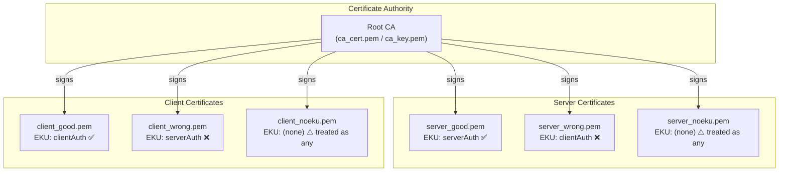
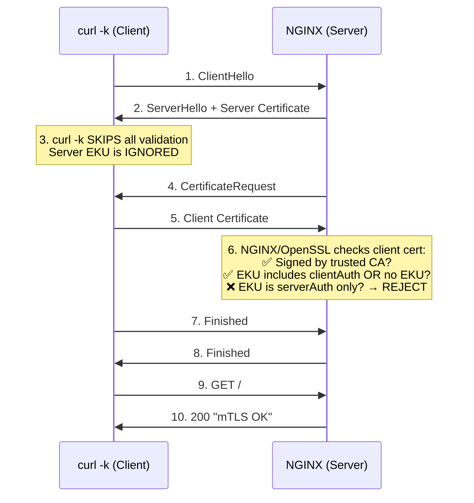
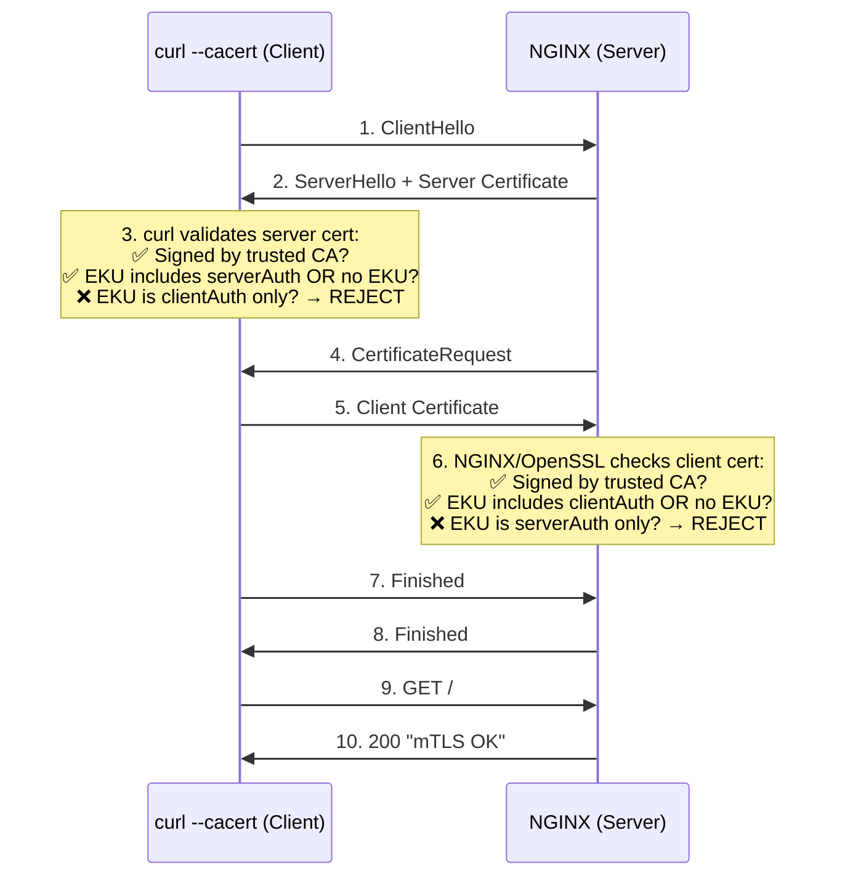
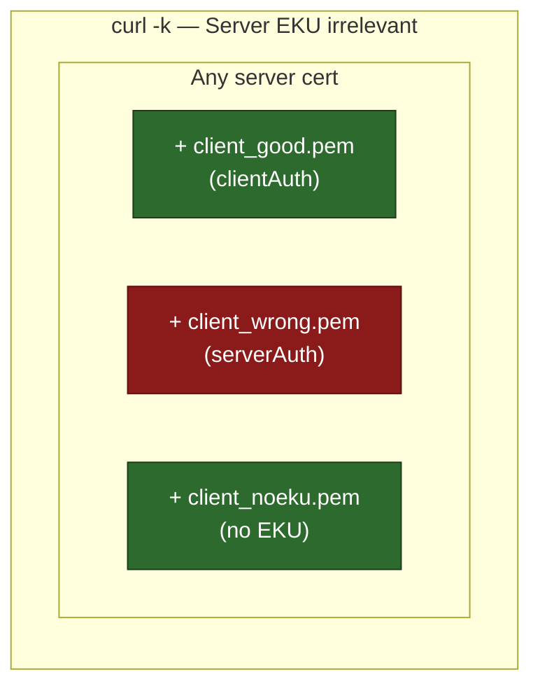
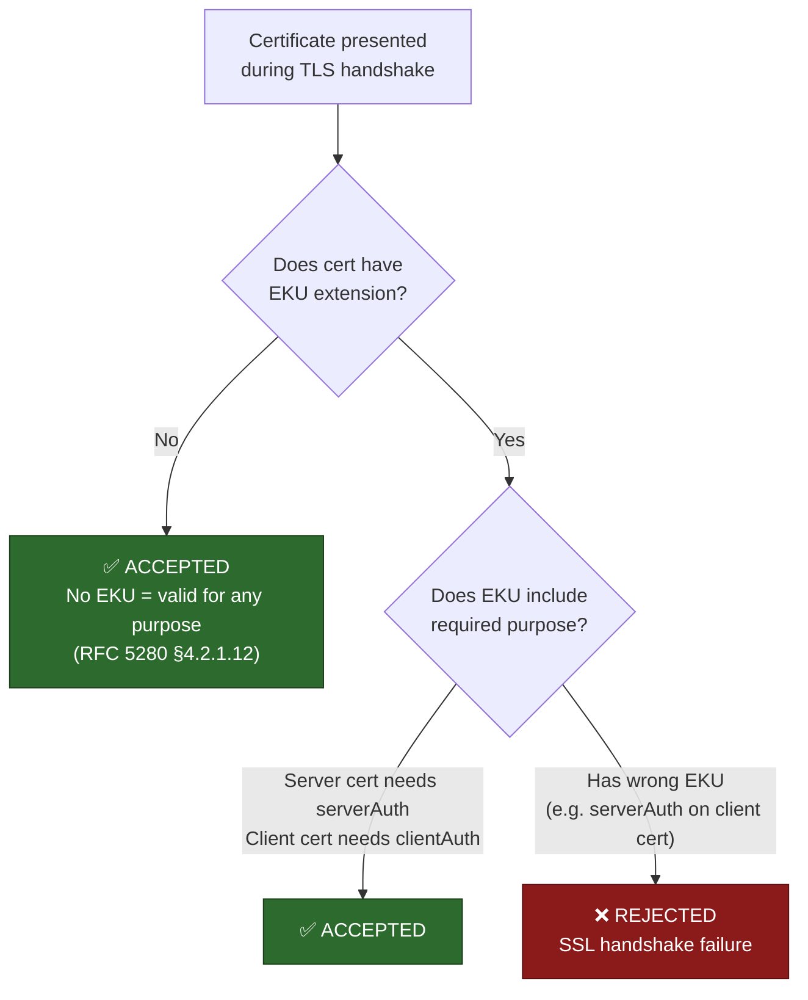
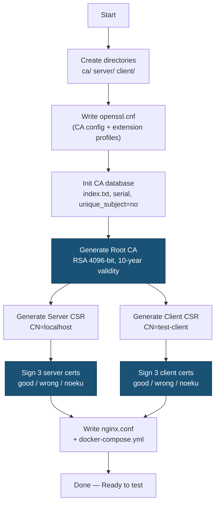

# mTLS Lab — Mutual TLS Testing Environment

A self-contained lab for generating and testing **mutual TLS (mTLS)** certificates with various Extended Key Usage (EKU) combinations. Uses OpenSSL for certificate generation and NGINX as the mTLS-enforcing server.

---

## Overview

This lab creates a full PKI (Root CA → Server Certs → Client Certs) and an NGINX reverse proxy that enforces client-certificate verification. It generates **correct** and **deliberately broken** certificates so you can observe exactly how mTLS handshakes succeed or fail based on EKU settings.

### Key Findings

Testing reveals two important behaviors that are often misunderstood:

1. **`curl -k` disables ALL server-side validation** — including EKU checks. To properly test server cert EKU, you must use `--cacert` instead of `-k`.
2. **No EKU ≠ restricted** — per the X.509 standard ([RFC 5280 §4.2.1.12](https://datatracker.ietf.org/doc/html/rfc5280#section-4.2.1.12)), a certificate **without** an EKU extension is considered valid for **any** purpose. Only an explicit wrong EKU causes rejection.

---

## Architecture



---

## mTLS Handshake Flow

### With `curl -k` (insecure — skips server validation)



### With `--cacert` (secure — validates server cert properly)



---

## Test Results

### Test A: Using `curl -k` (server EKU not validated)

Since `curl -k` skips all server certificate validation, only the **client cert EKU** matters.



| Server Cert | Client Cert | Result | Why |
|---|---|---|---|
| `server_good.pem` (serverAuth) | `client_good.pem` (clientAuth) | **✅ mTLS OK** | Correct EKU |
| `server_good.pem` (serverAuth) | `client_wrong.pem` (serverAuth) | **❌ Handshake failure** | Wrong EKU — explicitly `serverAuth`, not `clientAuth` |
| `server_good.pem` (serverAuth) | `client_noeku.pem` (no EKU) | **✅ mTLS OK** | No EKU = unrestricted = valid for any purpose |
| `server_wrong.pem` (clientAuth) | `client_good.pem` (clientAuth) | **✅ mTLS OK** | `-k` skips server validation; client EKU correct |
| `server_wrong.pem` (clientAuth) | `client_wrong.pem` (serverAuth) | **❌ Handshake failure** | Client EKU wrong — server EKU irrelevant with `-k` |
| `server_wrong.pem` (clientAuth) | `client_noeku.pem` (no EKU) | **✅ mTLS OK** | `-k` skips server; no EKU = unrestricted |
| `server_noeku.pem` (no EKU) | `client_good.pem` (clientAuth) | **✅ mTLS OK** | `-k` skips server; client EKU correct |
| `server_noeku.pem` (no EKU) | `client_wrong.pem` (serverAuth) | **❌ Handshake failure** | Client EKU wrong |
| `server_noeku.pem` (no EKU) | `client_noeku.pem` (no EKU) | **✅ mTLS OK** | Both unrestricted |

### Test B: Using `--cacert` (proper server EKU validation)

Removing `-k` and using `--cacert ca/ca_cert.pem` enables **both** server and client EKU checks.

| Server Cert | Client Cert | Result | Why |
|---|---|---|---|
| `server_good.pem` (serverAuth) | `client_good.pem` (clientAuth) | **✅ mTLS OK** | Both EKUs correct |
| `server_good.pem` (serverAuth) | `client_wrong.pem` (serverAuth) | **❌ Handshake failure** | Client: wrong EKU |
| `server_good.pem` (serverAuth) | `client_noeku.pem` (no EKU) | **✅ mTLS OK** | No EKU = unrestricted |
| `server_wrong.pem` (clientAuth) | `client_good.pem` (clientAuth) | **❌ curl rejects server** | Server: wrong EKU |
| `server_noeku.pem` (no EKU) | `client_good.pem` (clientAuth) | **✅ mTLS OK** | Server no EKU = unrestricted |

---

## EKU Decision Logic



---

## Certificate Generation Flow



---

## Directory Structure (after running the script)

```
mtls-lab/
├── ca/
│   ├── openssl.cnf         # CA configuration + extension profiles
│   ├── ca_cert.pem          # Root CA certificate
│   ├── ca_key.pem           # Root CA private key
│   ├── index.txt            # CA certificate database
│   ├── index.txt.attr       # unique_subject = no
│   ├── serial               # Next serial number
│   └── certs/               # Signed certificate copies
├── server/
│   ├── server_key.pem       # Server private key
│   ├── server_csr.pem       # Server CSR
│   ├── server_good.pem      # ✅ EKU: serverAuth
│   ├── server_wrong.pem     # ❌ EKU: clientAuth (wrong)
│   └── server_noeku.pem     # ❌ No EKU
├── client/
│   ├── client_key.pem       # Client private key
│   ├── client_csr.pem       # Client CSR
│   ├── client_good.pem      # ✅ EKU: clientAuth
│   ├── client_wrong.pem     # ❌ EKU: serverAuth (wrong)
│   └── client_noeku.pem     # ❌ No EKU
├── nginx.conf               # NGINX mTLS config
└── docker-compose.yml       # Docker Compose for NGINX
```

---

## Prerequisites

- **OpenSSL** (1.1+ or 3.x)
- **Docker** & **Docker Compose** (for the NGINX server)
- **curl** (for testing)

---

## Quick Start

### 1. Generate all certificates

```bash
chmod +x generate-certs.sh
./generate-certs.sh
```

### 2. Start the NGINX mTLS server

```bash
cd mtls-lab
docker compose up -d
```

### 3. Test client cert EKU (using `curl -k`)

With `-k`, curl skips server cert validation — only client cert EKU matters.

```bash
# ✅ PASS — client cert has correct EKU (clientAuth)
curl -vk https://localhost:8443 \
  --cert client/client_good.pem \
  --key client/client_key.pem

# ❌ FAIL — client cert has wrong EKU (serverAuth instead of clientAuth)
curl -vk https://localhost:8443 \
  --cert client/client_wrong.pem \
  --key client/client_key.pem

# ✅ PASS — client cert has no EKU (unrestricted = accepted)
curl -vk https://localhost:8443 \
  --cert client/client_noeku.pem \
  --key client/client_key.pem
```

### 4. Test server cert EKU (using `--cacert`)

Remove `-k` and use `--cacert` so curl properly validates the server certificate.

```bash
# ✅ PASS — server cert has correct EKU (serverAuth)
curl -v --cacert ca/ca_cert.pem https://localhost:8443 \
  --cert client/client_good.pem \
  --key client/client_key.pem

# To test wrong server EKU, swap the cert in docker-compose.yml:
#   server_good.pem → server_wrong.pem
docker compose down && docker compose up -d

# ❌ FAIL — server cert has wrong EKU (clientAuth), curl rejects it
curl -v --cacert ca/ca_cert.pem https://localhost:8443 \
  --cert client/client_good.pem \
  --key client/client_key.pem

# To test no-EKU server cert, swap to server_noeku.pem:
#   server_wrong.pem → server_noeku.pem
docker compose down && docker compose up -d

# ✅ PASS — server cert has no EKU (unrestricted = accepted)
curl -v --cacert ca/ca_cert.pem https://localhost:8443 \
  --cert client/client_good.pem \
  --key client/client_key.pem
```

### 5. Clean up

```bash
docker compose down
cd ..
rm -rf mtls-lab
```

---

## How mTLS Works

### Standard TLS (one-way)
Only the **server** presents a certificate. The client verifies it.

### Mutual TLS (two-way)
Both the **server** and **client** present certificates. Each side verifies the other.

### Extended Key Usage (EKU)

The EKU extension restricts what a certificate can be used for:

| EKU Value | OID | Purpose |
|---|---|---|
| `serverAuth` | 1.3.6.1.5.5.7.3.1 | Identifies a TLS **server** |
| `clientAuth` | 1.3.6.1.5.5.7.3.2 | Identifies a TLS **client** |

### EKU Validation Rules

| Cert has... | Checked against... | Result |
|---|---|---|
| `clientAuth` EKU | Needs `clientAuth` (client) | **✅ Accepted** — correct EKU |
| `serverAuth` EKU | Needs `clientAuth` (client) | **❌ Rejected** — explicit wrong purpose |
| **No EKU at all** | Needs `clientAuth` (client) | **✅ Accepted** — no restriction = any purpose |
| `serverAuth` EKU | Needs `serverAuth` (server) | **✅ Accepted** — correct EKU |
| `clientAuth` EKU | Needs `serverAuth` (server) | **❌ Rejected** — explicit wrong purpose |
| **No EKU at all** | Needs `serverAuth` (server) | **✅ Accepted** — no restriction = any purpose |

> **Important:** `curl -k` skips **all** server certificate validation (CA trust, hostname, AND EKU). To test server cert EKU rejection, you must use `--cacert ca_cert.pem` instead.

---

## Inspecting Certificates

```bash
# View full certificate details
openssl x509 -in mtls-lab/server/server_good.pem -text -noout

# Check just the EKU
openssl x509 -in mtls-lab/client/client_good.pem -text -noout | grep -A1 "Extended Key Usage"

# Verify a cert was signed by the CA
openssl verify -CAfile mtls-lab/ca/ca_cert.pem mtls-lab/client/client_good.pem
```

---

## Troubleshooting

| Problem | Cause | Fix |
|---|---|---|
| `There is already a certificate for /CN=...` | CA enforces unique subjects | Ensure `unique_subject = no` in `index.txt.attr` (already included in script) |
| `SSL: error:... alert handshake failure` | Client cert has explicit wrong EKU (`serverAuth`) | Use `client_good.pem` (clientAuth) or `client_noeku.pem` (unrestricted) |
| `curl: (60) SSL certificate problem` | Server cert has wrong EKU **and** you used `--cacert` | Use `server_good.pem` or `server_noeku.pem` |
| Server wrong EKU not rejected | You used `curl -k` which skips all server validation | Use `--cacert ca/ca_cert.pem` instead of `-k` |
| No-EKU cert accepted (unexpected) | X.509 spec: no EKU = valid for any purpose | This is correct behavior per RFC 5280 |
| `connection refused` on port 8443 | NGINX not running | Run `docker compose up -d` inside `mtls-lab/` |

---

## License

MIT
