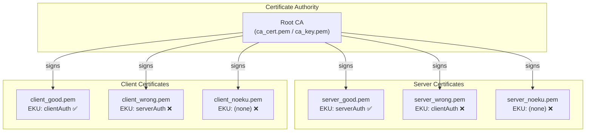
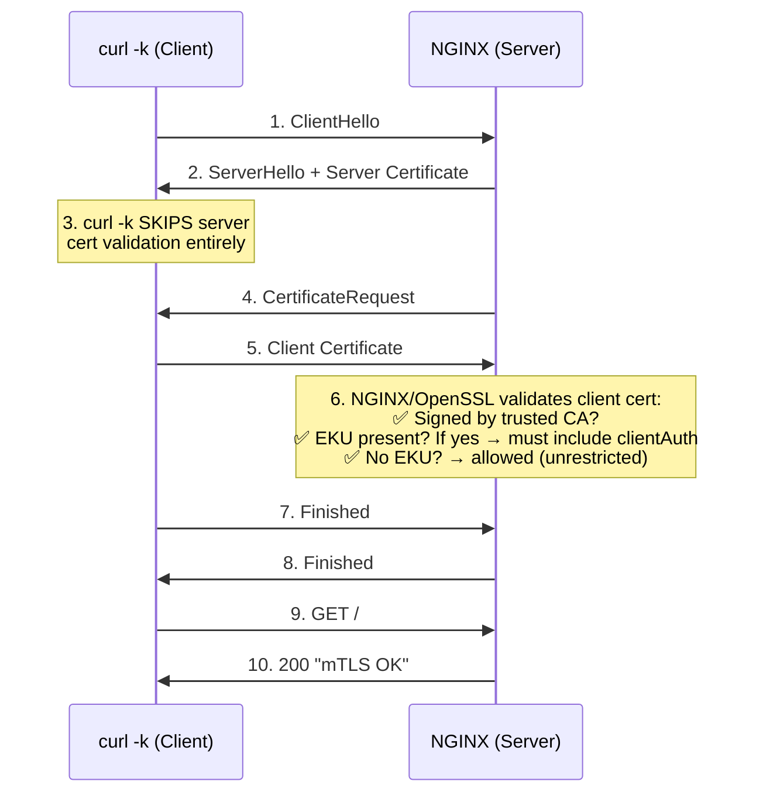
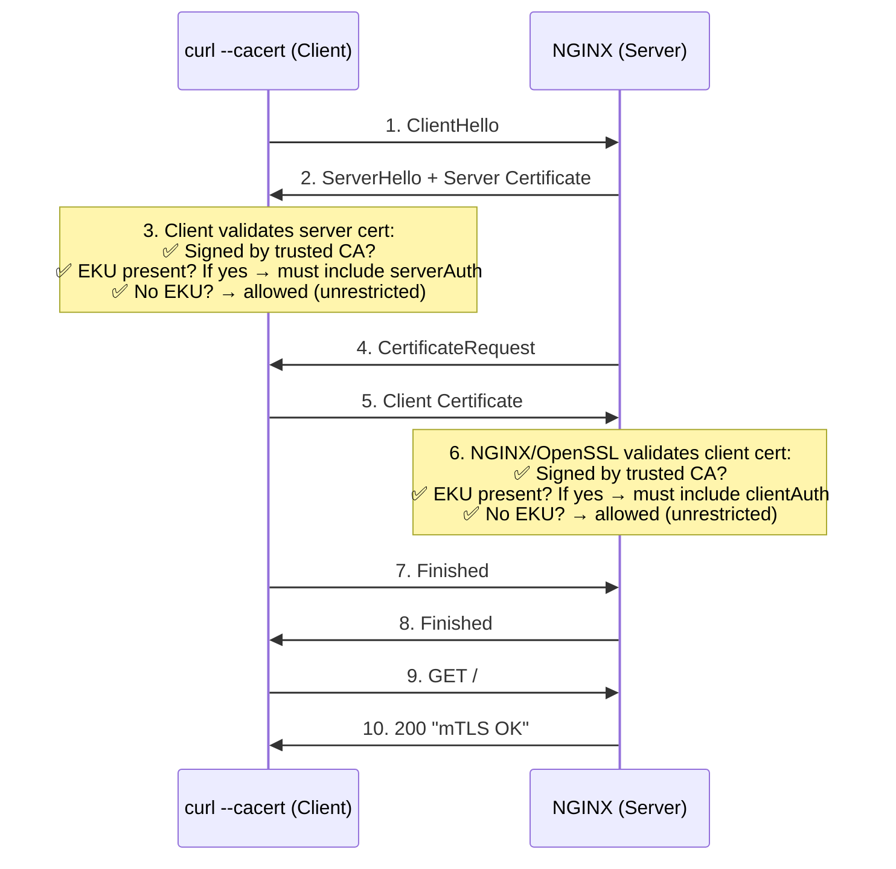
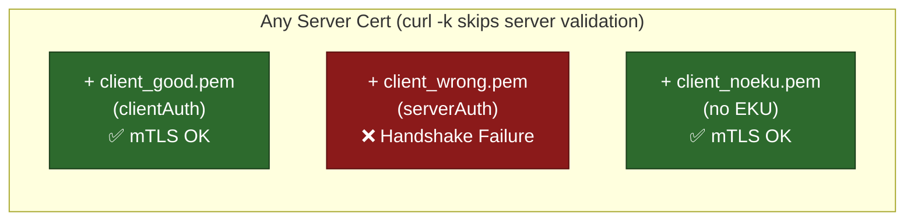
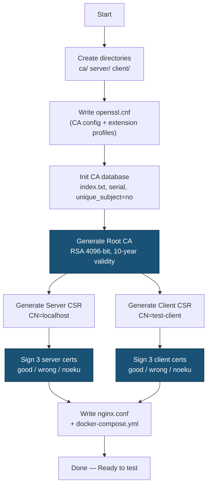
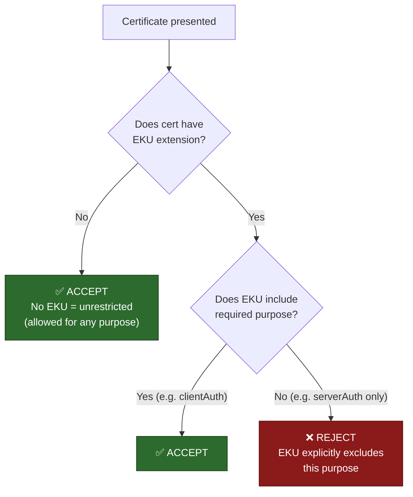

# mTLS Lab — Mutual TLS Testing Environment

A self-contained lab for generating and testing **mutual TLS (mTLS)** certificates with various Extended Key Usage (EKU) combinations. Uses OpenSSL for certificate generation and NGINX as the mTLS-enforcing server.

---

## Overview

This lab creates a full PKI (Root CA → Server Certs → Client Certs) and an NGINX reverse proxy that enforces client-certificate verification. It generates **correct** and **deliberately broken** certificates so you can observe exactly how mTLS handshakes succeed or fail based on EKU settings.

> **Key Discovery:** EKU enforcement is not as straightforward as it seems. OpenSSL only rejects a certificate if the EKU extension **is present but does not include the required purpose**. A certificate with **no EKU at all** is treated as unrestricted and accepted for any purpose. Additionally, `curl -k` disables all server-side certificate checks, so server EKU is only validated when strict verification is enabled.

---

## Architecture



---

## mTLS Handshake Flow

### With `curl -k` (insecure mode — server cert NOT validated)



### Without `-k` (strict mode — full validation on both sides)



---

## Test Matrix — Verified Results

### With `curl -k` (insecure — skips server cert validation)

Since `curl -k` disables server certificate checks, **only the client cert EKU matters**.



| Server Cert | Client Cert | Result (`curl -k`) | Why |
|---|---|---|---|
| `server_good.pem` (serverAuth) | `client_good.pem` (clientAuth) | **✅ mTLS OK** | Correct EKU |
| `server_good.pem` (serverAuth) | `client_wrong.pem` (serverAuth) | **❌ Handshake failure** | EKU present but wrong |
| `server_good.pem` (serverAuth) | `client_noeku.pem` (no EKU) | **✅ mTLS OK** | No EKU = unrestricted |
| `server_wrong.pem` (clientAuth) | `client_good.pem` (clientAuth) | **✅ mTLS OK** | Server not checked (`-k`) |
| `server_wrong.pem` (clientAuth) | `client_wrong.pem` (serverAuth) | **❌ Handshake failure** | EKU present but wrong |
| `server_wrong.pem` (clientAuth) | `client_noeku.pem` (no EKU) | **✅ mTLS OK** | No EKU = unrestricted |
| `server_noeku.pem` (no EKU) | `client_good.pem` (clientAuth) | **✅ mTLS OK** | Server not checked (`-k`) |
| `server_noeku.pem` (no EKU) | `client_wrong.pem` (serverAuth) | **❌ Handshake failure** | EKU present but wrong |
| `server_noeku.pem` (no EKU) | `client_noeku.pem` (no EKU) | **✅ mTLS OK** | No EKU = unrestricted |

### With `--cacert` (strict — validates server cert too)

| Server Cert | Client Cert | Result (strict) | Why |
|---|---|---|---|
| `server_good.pem` (serverAuth) | `client_good.pem` (clientAuth) | **✅ mTLS OK** | Both EKUs correct |
| `server_good.pem` (serverAuth) | `client_wrong.pem` (serverAuth) | **❌ Handshake failure** | Client EKU wrong |
| `server_good.pem` (serverAuth) | `client_noeku.pem` (no EKU) | **✅ mTLS OK** | No client EKU = unrestricted |
| `server_wrong.pem` (clientAuth) | `client_good.pem` (clientAuth) | **❌ Server cert rejected** | Server EKU wrong |
| `server_noeku.pem` (no EKU) | `client_good.pem` (clientAuth) | **✅ mTLS OK** | No server EKU = unrestricted |

---

## Certificate Generation Flow



---

## Directory Structure (after running the script)

```
mtls-lab/
├── ca/
│   ├── openssl.cnf         # CA configuration + extension profiles
│   ├── ca_cert.pem          # Root CA certificate
│   ├── ca_key.pem           # Root CA private key
│   ├── index.txt            # CA certificate database
│   ├── index.txt.attr       # unique_subject = no
│   ├── serial               # Next serial number
│   └── certs/               # Signed certificate copies
├── server/
│   ├── server_key.pem       # Server private key
│   ├── server_csr.pem       # Server CSR
│   ├── server_good.pem      # ✅ EKU: serverAuth
│   ├── server_wrong.pem     # ❌ EKU: clientAuth (wrong)
│   └── server_noeku.pem     # ❌ No EKU
├── client/
│   ├── client_key.pem       # Client private key
│   ├── client_csr.pem       # Client CSR
│   ├── client_good.pem      # ✅ EKU: clientAuth
│   ├── client_wrong.pem     # ❌ EKU: serverAuth (wrong)
│   └── client_noeku.pem     # ❌ No EKU
├── nginx.conf               # NGINX mTLS config
└── docker-compose.yml       # Docker Compose for NGINX
```

---

## Prerequisites

- **OpenSSL** (1.1+ or 3.x)
- **Docker** & **Docker Compose** (for the NGINX server)
- **curl** (for testing)

---

## Quick Start

### 1. Generate all certificates

```bash
chmod +x generate-certs.sh
./generate-certs.sh
```

### 2. Start the NGINX mTLS server

```bash
cd mtls-lab
docker compose up -d
```

### 3. Run the automated test matrix

```bash
chmod +x run-tests.sh
./run-tests.sh
```

This runs all 9 combinations of server × client certs and prints a results table.

### 4. Manual testing

```bash
cd mtls-lab

# ✅ PASS — correct client cert (EKU: clientAuth)
curl -vk https://localhost:8443 \
  --cert client/client_good.pem \
  --key client/client_key.pem

# ❌ FAIL — client cert has WRONG EKU (serverAuth instead of clientAuth)
curl -vk https://localhost:8443 \
  --cert client/client_wrong.pem \
  --key client/client_key.pem

# ✅ PASS — client cert has NO EKU (treated as unrestricted!)
curl -vk https://localhost:8443 \
  --cert client/client_noeku.pem \
  --key client/client_key.pem
```

### 5. Test with strict server cert validation

Remove `-k` and use `--cacert` to enable server cert verification:

```bash
# ✅ PASS — server has correct serverAuth EKU
curl -v --cacert ca/ca_cert.pem https://localhost:8443 \
  --cert client/client_good.pem \
  --key client/client_key.pem

# ❌ FAIL — swap server cert to server_wrong.pem in docker-compose.yml, then:
docker compose down && docker compose up -d
curl -v --cacert ca/ca_cert.pem https://localhost:8443 \
  --cert client/client_good.pem \
  --key client/client_key.pem
# curl rejects the server cert (EKU is clientAuth, not serverAuth)
```

### 6. Clean up

```bash
docker compose down
cd ..
rm -rf mtls-lab
```

---

## How mTLS Works

### Standard TLS (one-way)
Only the **server** presents a certificate. The client verifies it.

### Mutual TLS (two-way)
Both the **server** and **client** present certificates. Each side verifies the other.

### Extended Key Usage (EKU)
The EKU extension restricts what a certificate can be used for:

| EKU Value | OID | Purpose |
|---|---|---|
| `serverAuth` | 1.3.6.1.5.5.7.3.1 | Identifies a TLS **server** |
| `clientAuth` | 1.3.6.1.5.5.7.3.2 | Identifies a TLS **client** |

### EKU Validation Rules (Critical!)

OpenSSL's EKU enforcement follows this logic:



**Key insight:** A cert with **no EKU** is MORE permissive than one with the wrong EKU. The EKU extension, when present, acts as a whitelist — if the required purpose isn't listed, the cert is rejected.

### Impact of `curl -k`

| Flag | Server cert verified? | Server EKU checked? |
|---|---|---|
| `curl -k` (insecure) | ❌ No | ❌ No |
| `curl --cacert ca.pem` (strict) | ✅ Yes | ✅ Yes |

---

## Inspecting Certificates

```bash
# View full certificate details
openssl x509 -in mtls-lab/server/server_good.pem -text -noout

# Check just the EKU
openssl x509 -in mtls-lab/client/client_good.pem -text -noout | grep -A1 "Extended Key Usage"

# Verify a cert was signed by the CA
openssl verify -CAfile mtls-lab/ca/ca_cert.pem mtls-lab/client/client_good.pem
```

---

## Troubleshooting

| Problem | Cause | Fix |
|---|---|---|
| `There is already a certificate for /CN=...` | CA enforces unique subjects | Ensure `unique_subject = no` in `index.txt.attr` (already included in script) |
| `SSL: error:... alert handshake failure` | Client cert has EKU but it doesn't include `clientAuth` | Use `client_good.pem` or `client_noeku.pem` |
| `curl: (60) SSL certificate problem` | Server cert has wrong EKU (only when NOT using `-k`) | Use `server_good.pem` or `server_noeku.pem`, or add `-k` |
| Client cert with no EKU is accepted | OpenSSL treats missing EKU as unrestricted | This is by design — add explicit EKU to restrict usage |
| `connection refused` on port 8443 | NGINX not running | Run `docker compose up -d` inside `mtls-lab/` |

---

## License

MIT
